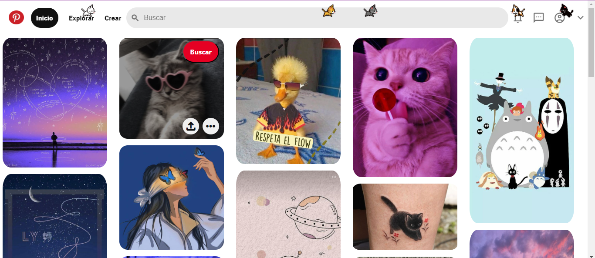

# Clon de Pinterest con HTML y CSS

Este proyecto es un clon de la interfaz de usuario de Pinterest, creado puramente con HTML y CSS. Se enfoca en replicar la apariencia visual de Pinterest, ofreciendo una experiencia de navegación similar con un diseño reponsive y funcionalidades básicas.

### Características
+ **Diseño Responsive:** Adaptable a diferentes tamaños de pantalla para una experiencia de usuario óptima en dispositivos móviles y de escritorio.
+ **Interfaz de Usuario Intuitiva:** Inspirada en [Pinterest](https://mx.pinterest.com/), con una navegación fácil y accesible.
+ **Interacciones Dinámicas:** Efectos visuales para elementos interactivos comno botones y enlaces.
+ **Iconografía y Estilos Modernos:** Uso de la biblioteca de íconos de Material Desing y estilos CSS modernos para una apariencia cool.

  ### Tecnologías Utilizadas
  + **HTML5:** Para la estructura básica del sitio.
  + **CSS3:** Para el diseño y estilo, incluyendo _flexbox_ para un diseño responsivo y efectos de _hover_.
  + **Google Fonts:** Para fuentes personalizadas.
 
  ### Vista Previa del Proyecto
  

  ### Licencia
  Distribuido bajo la Licencia MIT. Consulta `LICENSE` para obtener más información.

  ### Contacto
  Johana Diaz: [Mi Linkedin](www.linkedin.com/in/johana-diaz-galván-22905b255)
